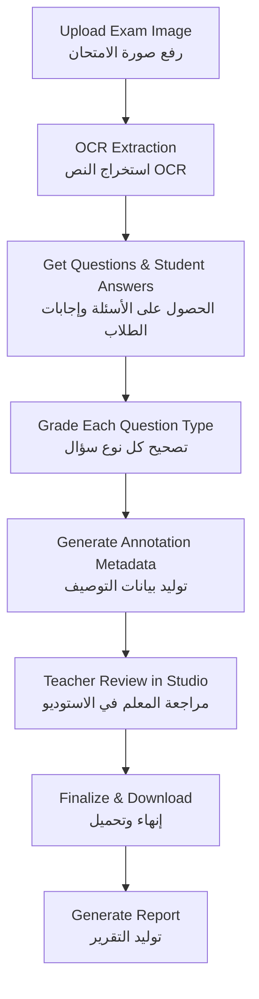

# Gradeo API Documentation | توثيق واجهة برمجة تطبيقات Gradeo

**Version:** 1.0  
**Base URL:** `http://your-server:5000`

---

## System Overview | نظرة عامة على النظام

Gradeo is a production-ready API for automated exam grading combining:
تم تصميم واجهة Gradeo لتصحيح الامتحانات آليًا وتجمع بين:
- **OCR** - Extracts questions from scanned exam papers (3 languages, 12 question types)
من ورقات الامتحان الممسوحة ضوئيًا (3 لغات، 12 نوعًا من الأسئلة) OCR استخراج الأسئلة عبر -
- **Grading** - Grades all question types with AI + code-based scoring (3-pass consistency)
تصحيح كافة أنواع الأسئلة باستخدام الذكاء الاصطناعي والتصحيح البرمجي (بثبات عبر 3 محاولات) -
- **Annotation** - Overlays teacher-style correction marks on scanned papers
إضافة علامات التصحيح بأسلوب المعلم على الأوراق الممسوحة ضوئيًا -
- **Review Studio** - Interactive web interface for teacher review and customization
واجهة ويب تفاعلية لمراجعة وتخصيص التصحيح من قبل المعلم -
- **Reports** - Generates professional DOCX/PDF grade reports
توليد تقارير درجات احترافية بصيغة DOCX و PDF -

**Powered by:** Google Gemini 2.0 Flash

---

## Table of Contents | جدول المحتويات

1. [OCR Endpoints | نقاط نهاية OCR](#1-ocr-endpoints--نقاط-نهاية-ocr)
2. [Grading Endpoints | نقاط نهاية التصحيح](#2-grading-endpoints--نقاط-نهاية-التصحيح)
3. [Annotation Endpoint | نقطة نهاية التعليقات](#3-annotation-endpoint--نقطة-نهاية-التعليقات)
4. [Report Endpoint | نقطة نهاية التقارير](#4-report-endpoint--نقطة-نهاية-التقارير)
5. [Review Studio | استوديو المراجعة](#5-review-studio--استوديو-المراجعة)
6. [Test Console | وحدة التحكم للاختبار](#6-test-console--وحدة-التحكم-للاختبار)
7. [Frontend Integration Guide | دليل دمج الواجهة الأمامية](#7-frontend-integration-guide--دليل-دمج-الواجهة-الأمامية)

---

## 1. OCR Endpoints | نقاط نهاية OCR

Extract structured question data from scanned exam papers (PDF or images).
استخراج بيانات الأسئلة المنظمة من أوراق الامتحان الممسوحة ضوئيًا (ملفات PDF أو صور).

**Base Path:** `/api/ocr`

### Supported Languages | اللغات المدعومة

| Language | Endpoint | Description |
|----------|----------|-------------|
| English | `/api/ocr/english` | Full English prompts |
| Arabic | `/api/ocr/arabic` | Native Arabic prompts (أسئلة عربية) |
| French | `/api/ocr/french` | French language support |

### 12 Question Types | 12 نوع من الأسئلة

| # | Type | Description | Key Fields |
|---|------|-------------|------------|
| 1 | `multiple_choice` | A, B, C, D options | `options`, `correct_answer` |
| 2 | `true_false` | True/False statements | `correct_answer` |
| 3 | `matching` | Two columns to connect | `left_column`, `right_column`, `correct_matches` |
| 4 | `fill_in_blank` | Sentences with blanks | `blanks` |
| 5 | `ordering` | Items to arrange | `ordering_items`, `correct_order` |
| 6 | `short_answer` | Brief factual answers | `expected_answer_count`, `acceptable_answers` |
| 7 | `open_ended` | Analytical written responses | `answer_length`, `expected_keywords`, `model_answer` |
| 8 | `compare_contrast` | Compare 2+ items | `compare_items`, `grading_table` |
| 9 | `definition` | Define a term | `term_to_define`, `model_answer` |
| 10 | `labeling` | Label diagram parts | `labeling_items`, `diagram_description` |
| 11 | `math_equation` | Math problems (PEMDAS) | `math_content`, `correct_answer` |
| 12 | `table` | Table completion | `table_headers`, `grading_table` |

> **Note:** `short_answer` is for brief factual questions ("State 4...", "Name..."), while `open_ended` is for analytical questions requiring explanation.
>
> **ملاحظة:** تستخدم `short_answer` للأسئلة الوقائعية القصيرة ("اذكر 4..."، "سمّ...")، بينما تستخدم `open_ended` للأسئلة التحليلية التي تتطلب شرحًا.

### `POST /api/ocr/english`
### `POST /api/ocr/arabic`
### `POST /api/ocr/french`

**Request Type:** `multipart/form-data`

| Field | Type | Required | Description |
|-------|------|----------|-------------|
| `file` | File | ✅ | Image file (PNG, JPG, PDF) |

**Response:**
```json
{
  "success": true,
  "data": {
    "raw_text": "Full OCR text...",
    "structured_data": {
      "questions": [
        {
          "order": 1,
          "question_number": "1",
          "question_type": "multiple_choice",
          "question_text": "What is the capital of France?",
          "options": {"A": "London", "B": "Paris", "C": "Berlin"},
          "correct_answer": "B",
          "points": 2.0,
          "instructions": "Choose the best answer"
        },
        {
          "order": 2,
          "question_number": "2",
          "question_type": "short_answer",
          "question_text": "State 3 primary colors",
          "expected_answer_count": 3,
          "acceptable_answers": ["red", "blue", "yellow"],
          "points": 3.0
        }
      ],
      "exam_header": {
        "title": "Geography Quiz",
        "subject": "Geography",
        "date": "2026-01-17",
        "instructions": "Answer all questions",
        "sections": ["Part A", "Part B"]
      }
    }
  }
}
```

**Frontend Integration | دمج الواجهة الأمامية:**

```javascript
// Mobile / Web - Upload image for OCR
const formData = new FormData();
formData.append('file', imageFile);

// Choose endpoint based on document language
const language = 'english'; // or 'arabic', 'french'
const response = await fetch(`/api/ocr/${language}`, {
  method: 'POST',
  body: formData
});

const result = await response.json();
if (result.success) {
  const questions = result.data.structured_data.questions;
  // Each question has: question_type, question_text, correct_answer, points, etc.
}
```

---

## 2. Grading Endpoints | نقاط نهاية التصحيح

Grade student answers against correct answers.
تصحيح إجابات الطلاب مقابل الإجابات الصحيحة.

**Base Path:** `/api/grading`

### Grading Categories | فئات التصحيح

**Category A: Code-Based Grading (Instant)**
**الفئة أ: التصحيح البرمجي (فوري)**
- Multiple Choice, True/False, Matching, Fill-in-Blank, Ordering
- الاختيار من متعدد، صح/خطأ، المطابقة، أكمل الفراغ، الترتيب

**Category B: AI-Graded with 3-Pass Consistency**
**الفئة ب: تصحيح الذكاء الاصطناعي (أمان بـ 3 محاولات)**
- Short Answer, Open-Ended, Compare/Contrast, Definition, Table, Math Equations, Labeling
- إجابة قصيرة، أسئلة مفتوحة، مقارنة وتباين، تعريف، جداول، معادلات رياضية، تسمية

> **3-Pass Grading:** AI grades each question 3 times, takes the mode (most common) result. If all 3 differ, flags for human review.
>
> **التصحيح بـ 3 محاولات:** يقوم الذكاء الاصطناعي بتصحيح كل سؤال 3 مرات، ويأخذ النتيجة الأكثر تكرارًا. إذا اختلفت النتائج الثلاثة، يتم تمييز السؤال للمراجعة البشرية.


### 2.1 Multiple Choice | الاختيار من متعدد

**Endpoint:** `POST /api/grading/multiple-choice` or `POST /api/grading/mcq`

**Request (All Fields):**
```json
{
  "questions": [
    {
      "question_number": "1",
      "question_text": "What is the capital of France?",
      "options": {"A": "London", "B": "Paris", "C": "Berlin", "D": "Madrid"},
      "correct_answer": "B"
    }
  ],
  "student_answers": {"1": "B", "2": "C"},
  "points_per_question": 1.0
}
```

**Response (All Fields):**
```json
{
  "success": true,
  "data": {
    "question_type": "multiple_choice",
    "total_questions": 2,
    "correct_count": 1,
    "incorrect_count": 1,
    "points_earned": 1.0,
    "points_possible": 2.0,
    "percentage": 50.0,
    "details": [
      {
        "question_number": "1",
        "question_text": "What is the capital of France?",
        "student_answer": "B",
        "correct_answer": "B",
        "is_correct": true,
        "points_earned": 1.0,
        "points_possible": 1.0
      }
    ]
  }
}
```

---

### 2.2 True/False | صح/خطأ

**Endpoint:** `POST /api/grading/true-false`

**Request (All Fields):**
```json
{
  "questions": [
    {
      "question_number": "1",
      "statement": "The Earth is flat",
      "correct_answer": false
    }
  ],
  "student_answers": {"1": false},
  "points_per_question": 1.0
}
```

---

### 2.3 Matching | المطابقة

**Endpoint:** `POST /api/grading/matching`

**Request (All Fields):**
```json
{
  "questions": [
    {
      "question_number": "1",
      "left_column": [
        {"id": "1", "text": "Dog"},
        {"id": "2", "text": "Cat"}
      ],
      "right_column": [
        {"id": "a", "text": "Barks"},
        {"id": "b", "text": "Meows"}
      ],
      "correct_matches": {"1": "a", "2": "b"},
      "points": 2.0
    }
  ],
  "student_answers": {"1": {"1": "a", "2": "b"}},
  "points_per_pair": 1.0
}
```

---

### 2.4 Fill-in-the-Blank | أكمل الفراغ

**Endpoint:** `POST /api/grading/fill-in-blank`

**Request (All Fields):**
```json
{
  "questions": [
    {
      "question_number": "1",
      "question_text": "Water is made of _____ and _____.",
      "blanks": ["hydrogen", "oxygen"],
      "points": 2.0
    }
  ],
  "student_answers": {"1": ["hydrogen", "oxygen"]},
  "points_per_blank": 1.0
}
```

---

### 2.5 Ordering | الترتيب

**Endpoint:** `POST /api/grading/ordering`

**Request (All Fields):**
```json
{
  "questions": [
    {
      "question_number": "1",
      "question_text": "Order planets from Sun",
      "ordering_items": [
        {"item_id": "A", "content": "Mercury"},
        {"item_id": "B", "content": "Venus"},
        {"item_id": "C", "content": "Earth"}
      ],
      "correct_order": ["A", "B", "C"],
      "points": 3.0
    }
  ],
  "student_answers": {"1": ["A", "B", "C"]},
  "points_per_position": 1.0
}
```

---

### 2.6 Labeling | التسمية

**Endpoint:** `POST /api/grading/labeling`

Grades diagram labeling questions based on data sent from the request (typically extracted during the OCR process).

يصحح أسئلة تسمية الأجزاء على الرسوم البيانية بناءً على البيانات المرسلة في الطلب (عادةً ما يتم استخراجها أثناء عملية OCR).

**Request (All Fields):**
```json
{
  "questions": [
    {
      "question_number": "1",
      "diagram_description": "Human heart diagram with numbered pointers",
      "labeling_items": [
        {"label_id": "1", "pointer_description": "Top left chamber", "correct_label": "Left Atrium"},
        {"label_id": "2", "pointer_description": "Bottom left chamber", "correct_label": "Left Ventricle"}
      ],
      "points": 2.0
    }
  ],
  "student_answers": {"1": {"1": "Left Atrium", "2": "Left Ventricle"}},
  "points_per_label": 1.0
}
```


---

### 2.7 Short Answer (NEW) | الإجابات القصيرة

**Endpoint:** `POST /api/grading/short-answer`

For brief factual answers (not analytical). Examples: "State 4 characteristics...", "Name 3 primary colors"

للإجابات الوقائعية القصيرة. أمثلة: "اذكر 4 خصائص..."، "سمّ 3 ألوان أساسية"

**Request (All Fields):**
```json
{
  "questions": [
    {
      "question_number": "1",
      "question_text": "State 3 primary colors",
      "acceptable_answers": ["red", "blue", "yellow"],
      "expected_answer_count": 3,
      "points": 3.0
    }
  ],
  "student_answers": {"1": "Red, blue, and yellow"}
}
```

**Response (AI-Graded 3-Pass):**
```json
{
  "success": true,
  "data": {
    "question_type": "short_answer",
    "total_questions": 1,
    "grading_passes_per_question": 3,
    "points_earned": 3.0,
    "points_possible": 3.0,
    "percentage": 100.0,
    "details": [
      {
        "question_number": "1",
        "criteria_results": {
          "factual_accuracy": {"status": "present", "weight": 0.6, "reason": "All 3 colors are correct"},
          "completeness": {"status": "present", "weight": 0.3, "reason": "All 3 requested items present"},
          "terminology": {"status": "present", "weight": 0.1, "reason": "Uses correct color names"}
        },
        "points_earned": 3.0,
        "points_possible": 3.0
      }
    ]
  }
}
```

**Criteria (3):**

| Criterion | Weight | Description |
|-----------|--------|-------------|
| `factual_accuracy` | 60% | Is the answer factually correct? |
| `completeness` | 30% | Are all requested items present? |
| `terminology` | 10% | Uses correct terms? |

---

### 2.8 Open-Ended (AI Grading) | الأسئلة المفتوحة

**Endpoint:** `POST /api/grading/open-ended`

Uses AI to grade essay-type answers against a model answer.
يستخدم الذكاء الاصطناعي لتصحيح الإجابات الإنشائية مقابل إجابة نموذجية.

**Request (All Fields):**
```json
{
  "questions": [
    {
      "question_number": "1",
      "question_text": "Explain the process of photosynthesis.",
      "model_answer": "Photosynthesis is the process by which green plants use sunlight, water, and carbon dioxide to produce glucose and oxygen. The process occurs in chloroplasts using chlorophyll.",
      "expected_keywords": ["chlorophyll", "sunlight", "glucose", "carbon dioxide", "oxygen"],
      "points": 10.0,
      "answer_length": "long"
    }
  ],
  "student_answers": {"1": "Plants use sunlight to make food using chlorophyll in leaves..."}
}
```

**Response (All Fields - AI-Graded):**
```json
{
  "success": true,
  "data": {
    "question_type": "open_ended",
    "total_questions": 1,
    "grading_passes_per_question": 3,
    "criteria_used": ["core_concept", "logical_explanation", "key_terms", "clarity_structure"],
    "flagged_for_review": 0,
    "points_earned": 8.5,
    "points_possible": 10.0,
    "percentage": 85.0,
    "details": [
      {
        "question_number": "1",
        "student_answer": "Plants use sunlight to make food...",
        "criteria_results": {
          "core_concept": {"status": "full", "weight": 0.4, "score": 0.4, "reason": "Student correctly explained photosynthesis"},
          "logical_explanation": {"status": "partial", "weight": 0.3, "score": 0.15, "reason": "Flow is good but missing details"},
          "key_terms": {"status": "full", "weight": 0.2, "score": 0.2, "found": ["chlorophyll", "sunlight"]},
          "clarity_structure": {"status": "full", "weight": 0.1, "score": 0.1, "reason": "Clear writing"}
        },
        "grading_passes": 3,
        "flag_for_review": false,
        "high_variance_criteria": [],
        "total_percentage": 85.0,
        "points_earned": 8.5,
        "points_possible": 10.0
      }
    ]
  }
}
```

---

### 2.9 Compare/Contrast | المقارنة والتباين

**Endpoint:** `POST /api/grading/compare-contrast`

Grade comparisons between two or more items using a criteria table.
تصحيح المقارنات بين عنصرين أو أكثر باستخدام جدول معايير.

**Request (All Fields):**
```json
{
  "questions": [
    {
      "question_number": "1",
      "question_text": "Compare and contrast mitosis and meiosis. Discuss similarities and differences.",
      "compare_items": ["mitosis", "meiosis"],
      "grading_table": [
        {"item": "Both involve cell division", "points": 2.0},
        {"item": "Mitosis produces 2 identical cells", "points": 2.5},
        {"item": "Meiosis produces 4 different cells", "points": 2.5},
        {"item": "Mitosis is for growth, meiosis for reproduction", "points": 3.0}
      ],
      "points": 10.0
    }
  ],
  "student_answers": {"1": "Mitosis and meiosis are both cell division processes..."}
}
```

---

### 2.10 Definition | التعريف

**Endpoint:** `POST /api/grading/definition`

Grade term definitions using required keywords and concepts.
تصحيح تعريفات المصطلحات باستخدام الكلمات المفتاحية والمفاهيم المطلوبة.

**Request (All Fields):**
```json
{
  "questions": [
    {
      "question_number": "1",
      "term_to_define": "Photosynthesis",
      "model_definition": "Photosynthesis is the process by which green plants and some organisms use sunlight, water, and carbon dioxide to synthesize glucose and release oxygen.",
      "required_keywords": ["sunlight", "water", "carbon dioxide", "glucose", "oxygen", "chlorophyll"],
      "points": 10.0
    }
  ],
  "student_answers": {"1": "Photosynthesis is when plants make food from sunlight..."}
}
```

---

### 2.11 Math Equations (PEMDAS) | المعادلات الرياضية

**Endpoint:** `POST /api/grading/math-equations`

Grades arithmetic problems using PEMDAS (Order of Operations) step-by-step breakdown. Uses AI multi-pass grading for consistency.

يصحح المسائل الحسابية باستخدام ترتيب العمليات (PEMDAS) خطوة بخطوة. يستخدم التصحيح المتعدد بالذكاء الاصطناعي للاتساق.

**Request (All Fields):**
```json
{
  "questions": [
    {
      "question_number": "1",
      "question_text": "Solve showing all steps: (2 + 3) × 4 - 6 ÷ 2",
      "math_content": "(2 + 3) × 4 - 6 ÷ 2",
      "correct_answer": "17",
      "points": 10.0
    }
  ],
  "student_answers": {
    "1": "2+3=5\n5×4=20\n6÷2=3\n20-3=17"
  }
}
```

**Response (All Fields - PEMDAS Step Grading):**
```json
{
  "success": true,
  "data": {
    "question_type": "math_equation",
    "total_questions": 1,
    "grading_passes_per_question": 3,
    "flagged_for_review": 0,
    "points_earned": 10.0,
    "points_possible": 10.0,
    "percentage": 100.0,
    "details": [
      {
        "question_number": "1",
        "problem": "(2 + 3) × 4 - 6 ÷ 2",
        "correct_answer": "17",
        "student_work": "2+3=5\n5×4=20\n6÷2=3\n20-3=17",
        "final_answer_correct": true,
        "total_steps": 4,
        "step_results": [
          {
            "step": 1,
            "operation": "parentheses",
            "expected": "(2 + 3) = 5",
            "expected_latex": "$(2 + 3) = 5$",
            "status": "present",
            "points_earned": 2.5,
            "points_possible": 2.5,
            "reason": "Student correctly evaluates parentheses: 2+3=5"
          },
          {
            "step": 2,
            "operation": "multiplication",
            "expected": "5 × 4 = 20",
            "expected_latex": "$5 \\times 4 = 20$",
            "status": "present",
            "points_earned": 2.5,
            "points_possible": 2.5,
            "reason": "Student correctly multiplies: 5×4=20"
          },
          {
            "step": 3,
            "operation": "division",
            "expected": "6 ÷ 2 = 3",
            "expected_latex": "$6 \\div 2 = 3$",
            "status": "present",
            "points_earned": 2.5,
            "points_possible": 2.5,
            "reason": "Student correctly divides: 6÷2=3"
          },
          {
            "step": 4,
            "operation": "subtraction",
            "expected": "20 - 3 = 17",
            "expected_latex": "$20 - 3 = 17$",
            "status": "present",
            "points_earned": 2.5,
            "points_possible": 2.5,
            "reason": "Student correctly subtracts to get final answer"
          }
        ],
        "grading_passes": 3,
        "flag_for_review": false,
        "high_variance_steps": [],
        "points_earned": 10.0,
        "points_possible": 10.0,
        "total_percentage": 100.0,
        "feedback": "",
        "annotation_feedback": ""
      }
    ]
  }
}
```

**Step Status Values | قيم حالة الخطوة:**

| Status | Description | Points | الوصف |
|--------|-------------|--------|-------|
| `present` | Step shown correctly | 100% | الخطوة صحيحة |
| `partial` | Step attempted with error | 50% | محاولة مع خطأ |
| `absent` | Step not shown | 0% | الخطوة مفقودة |

**Supported Operations:**
- `parentheses` - Brackets/parentheses evaluation
- `exponent` - Powers, square roots
- `multiplication` - Multiplication
- `division` - Division
- `addition` - Addition
- `subtraction` - Subtraction

---

### 2.12 Table | الجداول

**Endpoint:** `POST /api/grading/table`

Grade table completion questions with item-by-point scoring.
تصحيح أسئلة إكمال الجداول مع توزيع الدرجات لكل عنصر.

**Request (All Fields):**
```json
{
  "questions": [
    {
      "question_number": "1",
      "question_text": "Fill in the table about cell organelles and their functions",
      "grading_table": [
        {"item": "Mitochondria produces energy (ATP)", "points": 2.5},
        {"item": "Nucleus contains DNA/genetic material", "points": 2.5},
        {"item": "Ribosomes synthesize proteins", "points": 2.5},
        {"item": "Cell membrane controls entry/exit", "points": 2.5}
      ],
      "points": 10.0
    }
  ],
  "student_answers": {"1": "Mitochondria makes ATP. Nucleus has DNA. Ribosomes make proteins."}
}
```

---

## 3. Annotation Endpoint | نقطة نهاية التعليقات

Generate annotation metadata for teacher review.
توليد بيانات التوصيف لمراجعة المعلم.

**Endpoint:** `POST /api/annotation/generate`

**Request (All Fields):**
```json
{
  "exam_file": "BASE64_ENCODED_IMAGE",
  "file_type": "png",
  "grading_results": {
    "questions": [
      {
        "question_number": "1",
        "question_type": "multiple_choice",
        "points_earned": 2,
        "points_possible": 2,
        "correct_answer": "B",
        "feedback": ""
      },
      {
        "question_number": "2",
        "question_type": "multiple_choice",
        "points_earned": 0,
        "points_possible": 2,
        "correct_answer": "C",
        "feedback": "Jupiter is the largest planet in our solar system"
      },
      {
        "question_number": "3",
        "question_type": "open_ended",
        "points_earned": 7,
        "points_possible": 10,
        "correct_answer": "",
        "feedback": "Good analysis but missing details about economic consequences",
        "annotation_feedback": "تحليل جيد لكن ينقصك تفاصيل عن العواقب الاقتصادية"
      }
    ],
    "total_earned": 9,
    "total_possible": 14
  }
}
```

**Fields Explained | شرح الحقول:**

| Field | Type | Required | Description |
|-------|------|----------|-------------|
| `exam_file` | string | ✅ | Base64 encoded image/PDF |
| `file_type` | string | ✅ | "png", "jpg", or "pdf" |
| `grading_results.questions` | array | ✅ | Array of question results |
| `questions[].question_number` | string | ✅ | Question identifier |
| `questions[].question_type` | string | ❌ | "multiple_choice", "true_false", "open_ended", etc. |
| `questions[].points_earned` | number | ✅ | Points student earned |
| `questions[].points_possible` | number | ✅ | Max possible points |
| `questions[].correct_answer` | any | ❌ | Correct answer (shown when wrong) |
| `questions[].feedback` | string | ❌ | Teacher/AI feedback for this question |
| `questions[].annotation_feedback` | string | ❌ | Alternative feedback text in different language |
| `grading_results.total_earned` | number | ✅ | Total points earned |
| `grading_results.total_possible` | number | ✅ | Total possible points |

**Response (All Fields):**
```json
{
  "success": true,
  "data": {
    "annotation_metadata": [
      {
        "id": "q1_mark",
        "type": "check",
        "text": "✓ 2/2",
        "x": 150,
        "y": 200,
        "width": 100,
        "height": 40,
        "color": "#19aa19",
        "question_number": 1,
        "status": "pending"
      },
      {
        "id": "q2_mark",
        "type": "x",
        "text": "✗ 0/2",
        "x": 150,
        "y": 300,
        "width": 100,
        "height": 40,
        "color": "#be1e1e",
        "question_number": 2,
        "status": "pending"
      },
      {
        "id": "q2_correct",
        "type": "correct_answer",
        "text": "Correct: C",
        "x": 160,
        "y": 340,
        "width": 120,
        "height": 30,
        "color": "#143c8c",
        "question_number": 2,
        "status": "pending"
      },
      {
        "id": "q3_mark",
        "type": "partial",
        "text": "— 7/10",
        "x": 150,
        "y": 450,
        "width": 100,
        "height": 40,
        "color": "#c89600",
        "question_number": 3,
        "status": "pending"
      },
      {
        "id": "q3_feedback",
        "type": "feedback",
        "text": "Good analysis but missing details...",
        "x": 160,
        "y": 500,
        "width": 300,
        "height": 60,
        "color": "#143c8c",
        "question_number": 3,
        "status": "pending"
      }
    ],
    "corrected_image": "BASE64_ENCODED_IMAGE",
    "original_image": "BASE64_CLEAN_IMAGE",
    "filename": "exam_corrected.png",
    "pages_processed": 1,
    "annotations_added": 5,
    "is_draft": true
  }
}
```

---

## 4. Report Endpoint | نقطة نهاية التقارير

Generate professional exam reports in DOCX or PDF.
توليد تقارير امتحانات احترافية بصيغة DOCX أو PDF.

**Endpoint:** `POST /api/exam/report`

**Request (All Fields Including Sub-Questions):**
```json
{
  "student_info": {
    "name": "Ahmed Hassan / أحمد حسن",
    "section": "Grade 10-A",
    "date": "2026-01-17",
    "subject": "Multilingual Science Test"
  },
  "grading_results": {
    "grading": [
      {
        "question_number": "1",
        "student_answer": "B",
        "correct_answer": "B",
        "status": "Correct",
        "earned_points": 2,
        "possible_points": 2,
        "feedback": ""
      },
      {
        "question_number": "2",
        "student_answer": "A",
        "correct_answer": "C",
        "status": "Incorrect",
        "earned_points": 0,
        "possible_points": 2,
        "feedback": "Carbon is element #6"
      },
      {
        "question_number": "3",
        "student_answer": "القاهرة",
        "correct_answer": "القاهرة",
        "status": "Correct",
        "earned_points": 2,
        "possible_points": 2,
        "feedback": ""
      },
      {
        "question_number": "4",
        "student_answer": "صح",
        "correct_answer": "خطأ",
        "status": "Incorrect",
        "earned_points": 0,
        "possible_points": 2,
        "feedback": "القمر يدور حول الأرض وليس العكس"
      },
      {
        "question_number": "5",
        "student_answer": "Paris",
        "correct_answer": "Paris",
        "status": "Correct",
        "earned_points": 2,
        "possible_points": 2,
        "feedback": ""
      },
      {
        "question_number": "6",
        "sub_questions": [
          {
            "sub_number": "a",
            "student_answer": "H2O",
            "correct_answer": "H2O",
            "status": "Correct",
            "earned_points": 1,
            "possible_points": 1,
            "feedback": ""
          },
          {
            "sub_number": "b",
            "student_answer": "NaCl",
            "correct_answer": "NaCl",
            "status": "Correct",
            "earned_points": 1,
            "possible_points": 1,
            "feedback": ""
          },
          {
            "sub_number": "c",
            "student_answer": "CO2",
            "correct_answer": "CO3",
            "status": "Incorrect",
            "earned_points": 0,
            "possible_points": 1,
            "feedback": "Carbonate is CO3, not CO2"
          }
        ]
      },
      {
        "question_number": "7",
        "student_answer": "La Révolution a changé la société",
        "correct_answer": "",
        "status": "Partial",
        "earned_points": 3,
        "possible_points": 5,
        "feedback": "Bonne analyse mais il manque des détails sur les conséquences économiques"
      }
    ],
    "total_earned": 11,
    "total_possible": 18
  },
  "questions": [
    {"question_number": "1", "question_text": "What is the chemical symbol for water?"},
    {"question_number": "2", "question_text": "Which element has atomic number 6?"},
    {"question_number": "3", "question_text": "ما هي عاصمة مصر؟"},
    {"question_number": "4", "question_text": "الشمس تدور حول الأرض. (صح / خطأ)"},
    {"question_number": "5", "question_text": "Quelle est la capitale de la France?"},
    {"question_number": "6", "question_text": "Write the chemical formulas for: (a) Water (b) Salt (c) Carbonate"},
    {"question_number": "7", "question_text": "Expliquez le rôle de la Révolution française"}
  ],
  "format": "docx",
  "language": "en"
}
```

**Fields Explained | شرح الحقول:**

| Field | Type | Required | Description |
|-------|------|----------|-------------|
| `student_info.name` | string | ✅ | Student name |
| `student_info.section` | string | ❌ | Class/section |
| `student_info.date` | string | ❌ | Exam date |
| `student_info.subject` | string | ❌ | Subject name |
| `grading_results.grading` | array | ✅ | Array of graded questions |
| `grading[].question_number` | string | ✅ | Question identifier |
| `grading[].student_answer` | string | ✅ | What student answered |
| `grading[].correct_answer` | string | ❌ | The correct answer |
| `grading[].status` | string | ❌ | "Correct", "Incorrect", "Partial" |
| `grading[].earned_points` | number | ✅ | Points earned |
| `grading[].possible_points` | number | ✅ | Max points |
| `grading[].feedback` | string | ❌ | Teacher feedback |
| `grading[].sub_questions` | array | ❌ | Sub-questions (6a, 6b, 6c) |
| `sub_questions[].sub_number` | string | ✅ | "a", "b", "c", etc. |
| `sub_questions[].student_answer` | string | ✅ | Student's sub-answer |
| `sub_questions[].correct_answer` | string | ❌ | Correct sub-answer |
| `sub_questions[].earned_points` | number | ✅ | Points for this sub |
| `sub_questions[].possible_points` | number | ✅ | Max points for sub |
| `sub_questions[].feedback` | string | ❌ | Feedback for sub |
| `grading_results.total_earned` | number | ✅ | Final score numerator |
| `grading_results.total_possible` | number | ✅ | Final score denominator |
| `questions` | array | ❌ | Original question texts |
| `format` | string | ✅ | "docx" or "pdf" |
| `language` | string | ✅ | "en", "ar", or "fr" |

**Response:** Downloads the file directly (DOCX or PDF).
**الاستجابة:** تحميل الملف مباشرة (DOCX أو PDF).

---

## 5. Review Studio | استوديو المراجعة

**This is the main teacher review interface.**
**هذه هي الواجهة الرئيسية لمراجعة المعلم.**

### Web Access | الوصول عبر الويب

```
GET /review
```

Opens a full-screen interactive studio where teachers can:
يفتح استوديو تفاعلي بملء الشاشة حيث يمكن للمعلمين:
- Upload the original exam scan
رفع المسح الضوئي الأصلي للامتحان -
- Paste grading JSON data
لصق بيانات التصحيح بصيغة JSON -
- Drag/resize/customize annotations (colors, fonts, positions)
سحب/تغيير حجم/تخصيص التعليقات (الألوان، الخطوط، المواقع) -
- Toggle transparency for annotations
التحكم في شفافية التعليقات -
- Add Final Score labels
إضافة ملصقات الدرجة النهائية -
- Download the final annotated image
تحميل الصورة النهائية المصححة -

### Finalize Review API | واجهة إنهاء المراجعة

**Endpoint:** `POST /review/finalize`

Used internally by the studio to render annotations onto the image.

**Request (All Fields):**
```json
{
  "image": "BASE64_ENCODED_IMAGE",
  "annotations": [
    {
      "id": "q1_mark",
      "type": "check",
      "text": "✓ 5/5",
      "x": 100,
      "y": 200,
      "width": 140,
      "height": 48,
      "color": "#19aa19",
      "opacity": 1.0,
      "question_number": 1,
      "status": "approved"
    },
    {
      "id": "q2_mark",
      "type": "x",
      "text": "✗ 0/5",
      "x": 100,
      "y": 300,
      "width": 140,
      "height": 48,
      "color": "#be1e1e",
      "opacity": 1.0,
      "question_number": 2,
      "status": "pending"
    },
    {
      "id": "q2_correct",
      "type": "correct_answer",
      "text": "Correct: C",
      "x": 110,
      "y": 350,
      "width": 150,
      "height": 30,
      "color": "#143c8c",
      "opacity": 1.0,
      "question_number": 2,
      "status": "pending"
    },
    {
      "id": "q3_mark",
      "type": "partial",
      "text": "— 3/5",
      "x": 100,
      "y": 450,
      "width": 140,
      "height": 48,
      "color": "#c89600",
      "opacity": 1.0,
      "question_number": 3,
      "status": "pending"
    },
    {
      "id": "q3_feedback",
      "type": "feedback",
      "text": "Good explanation but missing key terms",
      "x": 110,
      "y": 500,
      "width": 300,
      "height": 60,
      "color": "#143c8c",
      "opacity": 0.9,
      "question_number": 3,
      "status": "pending"
    },
    {
      "id": "label1",
      "type": "label",
      "text": "Great work on this section!",
      "x": 150,
      "y": 600,
      "width": 200,
      "height": 40,
      "color": "#0ea5e9",
      "opacity": 1.0,
      "question_number": null,
      "status": "approved"
    },
    {
      "id": "final",
      "type": "final_score",
      "text": "TOTAL: 85/100",
      "x": 50,
      "y": 50,
      "width": 240,
      "height": 80,
      "color": "#4facfe",
      "opacity": 1.0,
      "question_number": null,
      "status": "approved"
    }
  ]
}
```

**Annotation Fields Explained | شرح حقول التوصيف:**

| Field | Type | Required | Description |
|-------|------|----------|-------------|
| `id` | string | ✅ | Unique identifier (e.g., "q1_mark", "final") |
| `type` | string | ✅ | "check", "x", "partial", "label", "correct_answer", "feedback", "final_score" |
| `text` | string | ✅ | Display text (e.g., "✓ 5/5", "Correct: B") |
| `x` | number | ✅ | X position in pixels |
| `y` | number | ✅ | Y position in pixels |
| `width` | number | ❌ | Width in pixels (default: 120) |
| `height` | number | ❌ | Height in pixels (default: 40) |
| `color` | string | ❌ | Hex color (default: "#4facfe") |
| `opacity` | number | ❌ | 0.0 to 1.0 for transparency (default: 1.0) |
| `question_number` | number/null | ❌ | Question this relates to (null for labels) |
| `status` | string | ❌ | "pending" or "approved" |

**Response:** Downloads the rendered PNG image.

### Mobile Integration | التكامل مع الموبايل

For mobile apps, you can:
في تطبيقات الجوال، يمكنك:
1. Call `/api/annotation/generate` to get annotation metadata
للحصول على بيانات التوصيف `/api/annotation/generate` استدعاء -
2. Display a native preview using the coordinates
عرض معاينة أصلية باستخدام الإحداثيات -
3. Allow teachers to adjust positions and customize everything (colors/fonts) like the /review route gui
تبديل المواقع وتخصيص كل شيء (الألوان/الخطوط) تمامًا مثل واجهة مراجعة الويب -
4. Call `/review/finalize` with the modified metadata
مع البيانات المعدلة `/review/finalize` استدعاء -
5. Download and display the final image
تحميل وعرض الصورة النهائية -

---

## 6. Test Console | وحدة التحكم للاختبار

**For development and testing only.**
**للتطوير والاختبار فقط.**

```
GET /test
```

Provides a web interface to test all endpoints with sample data. Features:
يوفر واجهة ويب لاختبار كافة نقاط النهاية مع بيانات تجريبية. الميزات:
- Pre-filled sample data for all question types
بيانات تجريبية جاهزة لكافة أنواع الأسئلة -
- Image upload for OCR testing
رفع الصور لاختبار OCR -
- Real-time response display
عرض الاستجابة في الوقت الفعلي -
- Report generation in multiple languages (English, Arabic, French)
توليد التقارير بلغات متعددة (الإنجليزية، العربية، الفرنسية) -
- Annotation customization testing
اختبار تخصيص التعليقات -

---

## Error Handling | معالجة الأخطاء

All endpoints return errors in this format:
تعيد كافة نقاط النهاية الأخطاء بهذا التنسيق:

```json
{
  "success": false,
  "error": "Error message describing the issue"
}
```

**Common HTTP Status Codes | أكواد الحالة الشائعة:**
- `200` - Success (نجاح)
- `400` - Bad Request (missing or invalid data) (طلب غير صالح - بيانات مفقودة أو غير صحيحة)
- `500` - Server Error (خطأ في الخادم)

---

## Integration Summary | ملخص التكامل

### Typical Grading Flow | تدفق التصحيح النموذجي



### API Endpoints Quick Reference | مرجع سريع

| Endpoint | Method | Description |
|----------|--------|-------------|
| `/api/ocr/english` | POST | English OCR |
| `/api/ocr/arabic` | POST | Arabic OCR |
| `/api/ocr/french` | POST | French OCR |
| `/api/grading/mcq` | POST | Grade MCQ |
| `/api/grading/true-false` | POST | Grade T/F |
| `/api/grading/matching` | POST | Grade Matching |
| `/api/grading/fill-in-blank` | POST | Grade Fill-in-Blank |
| `/api/grading/ordering` | POST | Grade Ordering |
| `/api/grading/labeling` | POST | Grade Labeling (text) |
| `/api/grading/short-answer` | POST | Grade Short Answer (NEW) |
| `/api/grading/open-ended` | POST | AI Grade Essays |
| `/api/grading/compare-contrast` | POST | Grade Comparisons |
| `/api/grading/definition` | POST | Grade Definitions |
| `/api/grading/math-equations` | POST | Grade Math (PEMDAS) |
| `/api/grading/table` | POST | Grade Tables |
| `/api/annotation/generate` | POST | Generate Annotations |
| `/api/exam/report` | POST | Generate Report (DOCX/PDF) |
| `/review` | GET | Review Studio UI |
| `/review/finalize` | POST | Render Final Image |
| `/test` | GET | Test Console |

---

## 7. Frontend Integration Guide | دليل دمج الواجهة الأمامية

### Quick Start | البداية السريعة

**Base URL Configuration:**
```javascript
// config.js
const API_BASE = 'http://your-server:5000';  // Update with your production URL
```

**Headers for JSON Requests:**
```javascript
const headers = {
  'Content-Type': 'application/json'
};
```

**Headers for File Upload (OCR) | ترويسات رفع الملفات:**
```javascript
// Do NOT set Content-Type for FormData - browser handles it automatically
// لا تضع Content-Type عند استخدام FormData - المتصفح يتعامل مع ذلك تلقائيًا
const formData = new FormData();
formData.append('file', imageFile);
```

---


**Last Updated:** January 2026
